

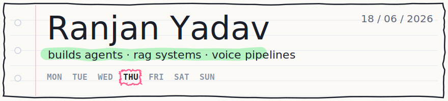

 

<table border="0"><tr><td>

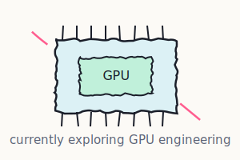

 

> open to **AI engineering** roles &nbsp;`intern or junior`
>
> timezones &nbsp;`EST` &nbsp;`IST` &nbsp;`GMT`
>
> reach me below &nbsp;👇

 

</td></tr></table>

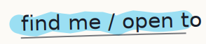

&nbsp;
&nbsp;
&nbsp;
&nbsp;
&nbsp;

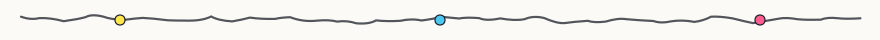

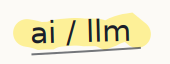

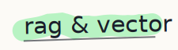

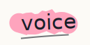

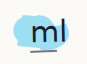

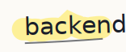

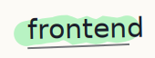

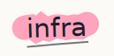

